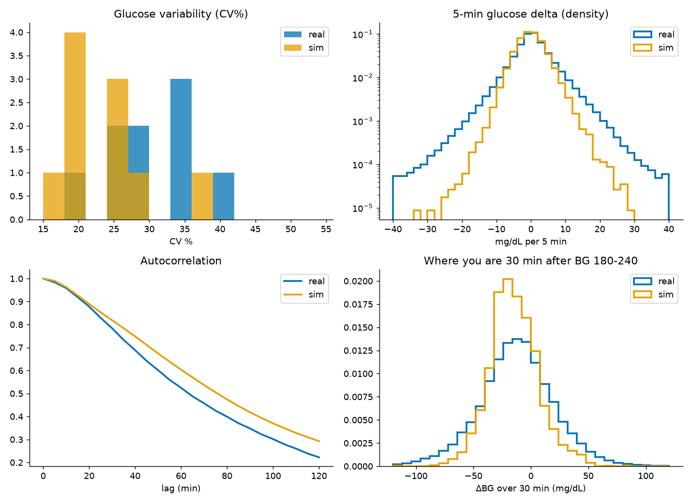

# Simulator-fidelity suite: where UVA/Padova diverges from real data

**Cohort:** 9 real users (~1 year each, 2025-08 to 2026-07) vs 10 UVA/Padova virtual patients (21 days, randomised announced meals).  
**Result:** 3 FAIL, 2 STRUCTURAL, 1 PASS of 6 signatures.

Each signature computes the same statistic on both cohorts. PASS = the simulator reproduces the real statistic; FAIL = it diverges; STRUCTURAL = the mechanism is absent from the model by construction.

| Signature | Category | Real | Sim | Verdict |
|---|---|---|---|---|
| Glucose variability (CV%) | distribution | 29.5 [24-35] | 22.4 [19-27] | **FAIL** |
| Short-horizon delta tails (5 min) | dynamics | 4.0 | 1.3 | **FAIL** |
| Autocorrelation (30/60 min) | dynamics | 0.78/0.52 | 0.82/0.6 | **PASS** |
| Outcome unpredictability (BG 180-240, +30 min) | efficacy | 33.0 [33-33] | 21.4 [21-22] | **FAIL** |
| Insulin-sensitivity drift (weekly, %CV) | non-stationarity | 22.1 [17-31] | 0.0 [0-0] | **STRUCTURAL** |
| Post-meal-exercise counterweight | exercise | crash rate falls with IOB (32/20/17% by tertile) | not representable | **STRUCTURAL** |



## What this means

The simulator does not fail everywhere. Its short-horizon autocorrelation matches, so for smooth, benign, announced-meal stretches it is a fair stand-in and remains usable for dosing-logic regression and sanity checks. It fails in a consistent direction on everything that makes our problem hard:

- **It runs too smooth.** Lower CV, thin delta tails, slower decorrelation. The fat positive delta tails it misses are exactly the unannounced-meal onsets that dominate our real highs, and its controller is told the carbs in advance.
- **Its insulin always works.** From a stuck-high band the sim reliably falls about 20 mg/dL over 30 min with little spread; reality is a coin-toss between climbing further and crashing (1.5x the spread, and Probe B shows the glucodynamics are deterministic to 0.00 across identical repeats). The efficacy blind spot is not in the model.
- **It never changes.** Real insulin sensitivity drifts ~22% week to week; the virtual patient's parameters are fixed. And it has no exercise input at all.

So a controller A/B on this simulator would score both controllers safe in precisely the regimes where real controllers crash (exercise), over-correct (efficacy), or get caught out by an unannounced meal or a sensitivity shift. The 'no counterfactual' caveat stays, now measured signature by signature rather than asserted. The suite is extensible: each new signature is one function in `signatures.py`.

## Per-signature notes

- **Glucose variability (CV%)** — median CV real 30% vs sim 22%. CV is the standard glucose-variability index; the sim runs smoother.
- **Short-horizon delta tails (5 min)** — P(rise>10): real 4.0% vs sim 1.3%; SD 6.1 vs 3.9; KS 0.07. Fat positive tails are unannounced-meal onsets the sim never sees.
- **Autocorrelation (30/60 min)** — ACF@30/60 real 0.78/0.52 vs sim 0.82/0.60. How fast the glucose curve decorrelates; a proxy for smoothness.
- **Outcome unpredictability (BG 180-240, +30 min)** — outcome SD real 33 vs sim 21 mg/dL  (x1.5). Real next-30-min outcome from a stuck-high band is far more spread than the sim's. See fidelity_test.py Probe B: sim glucodynamic variance across identical repeats is exactly 0.
- **Insulin-sensitivity drift (weekly, %CV)** — weekly-sensitivity CV real 22% vs sim 0% (fixed params). The virtual patient's parameters do not change over time; real insulin sensitivity drifts week to week. The sim is stationary.
- **Post-meal-exercise counterweight** — model input is (CHO, insulin); no exercise term in the ODE. See fidelity_test.py Probe A and the mechanism report. The insulin-independent exercise drain has no input path in the model.

## Reproduce

```
~/.venvs/boost-insilico/bin/python gen_sim_cohort.py --days 21
~/.venvs/boost-insilico/bin/python run_suite.py
```
