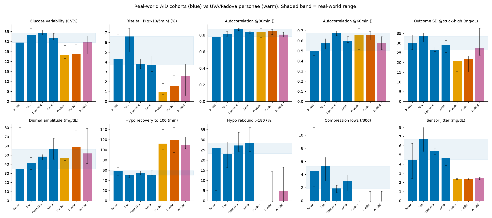

# Multi-cohort simulator fidelity: UVA/Padova vs real-world AID data

Real cohorts (local research DB) versus all three FDA/UVA-Padova persona classes. Each cell is the per-user median with a bootstrap 95% CI. The question is not only whether the adult personae match, but whether **any** persona class reproduces each real-world statistic.

| Cohort | n | kind |
|---|---|---|
| Boost | 9 | real |
| Trio | 29 | real |
| OpenAPS | 110 | real |
| AAPS-classic | 44 | real |
| Padova adult | 10 | sim |
| Padova adolescent | 10 | sim |
| Padova child | 10 | sim |

## Signature x cohort matrix

| Signature | Boost | Trio | OpenAPS | AAPS-classic | Padova adult | Padova adolescent | Padova child |
|---|---|---|---|---|---|---|---|
| Glucose variability (CV%) | 29.5 [24.3-35.3] | 33.4 [30.9-36.6] | 34.3 [33.2-35.5] | 31.9 [30.9-34.0] | 23.1 [21.5-28.0] ✗ | 23.8 [17.8-28.7] ✗ | 29.7 [23.8-32.8] |
| Rise tail P(Δ>10/5min) (%) | 4.3 [1.6-6.8] | 6.6 [5.0-7.4] | 3.8 [3.3-4.3] | 3.7 [3.0-4.6] | 1.0 [0.7-1.8] ✗ | 1.6 [0.8-2.7] ✗ | 2.6 [0.6-3.8] ✗ |
| Autocorrelation @30min () | 0.8 [0.7-0.8] | 0.8 [0.8-0.8] | 0.9 [0.9-0.9] | 0.8 [0.8-0.8] | 0.8 [0.8-0.9] | 0.9 [0.8-0.9] | 0.8 [0.8-0.8] |
| Autocorrelation @60min () | 0.5 [0.5-0.6] | 0.6 [0.5-0.6] | 0.7 [0.7-0.7] | 0.6 [0.6-0.6] | 0.7 [0.5-0.7] | 0.7 [0.6-0.7] | 0.6 [0.5-0.6] |
| Outcome SD @stuck-high (mg/dL) | 29.8 [26.6-34.1] | 33.5 [30.6-35.2] | 26.5 [25.6-28.0] | 28.8 [25.2-31.4] | 20.8 [15.2-24.4] ✗ | 21.7 [15.0-23.3] ✗ | 27.5 [23.7-37.6] |
| Diurnal amplitude (mg/dL) | 34.7 [26.9-80.1] | 41.3 [34.2-47.5] | 48.4 [44.7-50.4] | 56.3 [45.4-68.0] | 46.9 [44.1-59.9] | 58.7 [34.8-76.6] ✗ | 51.9 [40.7-79.1] |
| Hypo recovery to 100 (min) | 59.0 [50.0-65.0] | 50.0 [45.0-50.0] | 55.0 [50.8-58.2] | 50.0 [50.0-60.1] | 112.5 [101.2-140.0] ✗ | 118.8 [95.0-143.8] ✗ | 110.0 [102.5-125.0] ✗ |
| Hypo rebound >180 (%) | 25.8 [5.1-34.3] | 23.2 [16.3-29.0] | 27.2 [24.3-33.6] | 28.4 [24.3-36.0] | 0.0 [0.0-0.0] ✗ | 0.0 [0.0-14.3] ✗ | 4.6 [0.0-16.3] ✗ |
| Compression lows (/30d) | 4.6 [2.1-11.1] | 5.3 [3.0-6.6] | 1.9 [1.3-2.3] | 3.0 [1.4-3.9] | 0.0 [0.0-0.0] ✗ | 0.0 [0.0-1.4] ✗ | 0.0 [0.0-1.4] ✗ |
| Sensor jitter (mg/dL) | 4.5 [2.4-6.2] | 6.7 [5.4-8.0] | 5.5 [5.0-5.7] | 4.7 [3.9-5.8] | 2.4 [2.3-2.4] ✗ | 2.4 [2.3-2.4] ✗ | 2.5 [2.3-2.5] ✗ |
| ISF drift (weekly) (%CV) | 21.7 [17.5-30.6] | 15.1 [8.1-18.4] | 12.1 [10.7-14.4] | 8.2 [5.3-10.5] | 0.0 [0.0-0.0] ✗ | 0.0 [0.0-0.0] ✗ | 0.0 [0.0-0.0] ✗ |

✗ = outside the real-world range. 

## Which personae match, by signature

| Signature | personae in real range | verdict |
|---|---|---|
| Glucose variability | child | only child |
| Rise tail P(Δ>10/5min) | none | NO persona matches |
| Autocorrelation @30min | adult, adolescent, child | all personae match |
| Autocorrelation @60min | adult, adolescent, child | all personae match |
| Outcome SD @stuck-high | child | only child |
| Diurnal amplitude | adult, child | only adult, child |
| Hypo recovery to 100 | none | NO persona matches |
| Hypo rebound >180 | none | NO persona matches |
| Compression lows | none | NO persona matches |
| Sensor jitter | none | NO persona matches |
| ISF drift (weekly) | none | STRUCTURAL (sim fixed = 0) |

**5 of 11 signatures are reproduced by NO Padova persona class.**

## Reading the matrix

- **The four real datasets converge.** Boost, Trio, OpenAPS and AAPS-classic are four different algorithms built by different communities and worn by different people, yet they agree closely on every statistic. That agreement defines a real-world envelope and makes the simulator comparison meaningful rather than anecdotal.
- **The simulator gets short-horizon smoothness right.** Autocorrelation at 30 and 60 minutes lands in the real range for all three persona classes. On smooth, benign, announced-meal stretches it is a fair stand-in.
- **Aggregate variability is reachable only by the child persona.** CV and the stuck-high outcome spread reach the real range for children (the most variable class) but not for adults or adolescents, which run too smooth. Since controllers are typically evaluated on the adult personae, the default in-silico test understates real-world variability.
- **5 signatures are reproduced by no persona at any age.** These are the mechanistically important, safety-relevant ones: the fat rise tail of unannounced meals, hypo treatment (real lows recover about twice as fast and then overshoot; the sim has no rescue carbohydrate), sensor artefacts (compression lows and high-frequency jitter, both absent or halved), and week-to-week insulin-sensitivity drift (real loops vary 8-22%, the fixed-parameter model varies zero).
- **The child match is not a rescue.** A persona matching real variability does not make the simulator adequate: you would not test an adult controller on the child persona, and the child still fails every mechanism signature above.

The pattern is consistent with the single-cohort suite and the two structural probes: in-silico testing on this platform exercises the easy regime (smooth, announced, stationary, clean-sensor) and is blind to the hard one (unannounced meals, variable insulin efficacy, exercise, sensor artefact, sensitivity drift) that dominates real-world safety.
