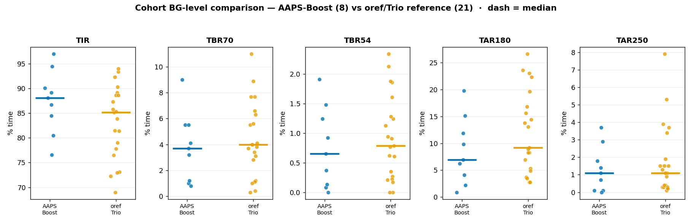

# Cohort BG-level comparison — AAPS-Boost vs the oref/Trio reference cohort

_2026-07-08. `boost_decisions` (AAPS-Boost, self+A–H+G) vs `multiuser_combined` (oref/Trio reference, U000–U020). Reproduce: `cohort_bglevel.py`._

## Why only BG-level

The Trio shadow emits boostV5 **state** but no `budget`/`steps`/`HR`, and 23 of the 24 Trio-tagged sites aren't extracted into `boost_decisions` at all (they carry oref fields only). So the Boost-specific cause attribution, the brake audit and the activity→hypo analysis **cannot run on Trio** and stay AAPS-only. What *is* comparable across every user is the glucose distribution + high/low residency from BG and the shared oref fields.

## Platform comparison (median across users)

| cohort | n | TING 63–140 | TIR 70–180 | TBR<70 | TBR<54 | TAR>180 | TAR>250 | CV |
|---|---|---|---|---|---|---|---|---|
| **AAPS-Boost** | 9 | **71.9** | **88.1** | **3.7** | **0.6** | **6.9** | 1.1 | **30** |
| oref/Trio | 21 | 67.4 | 85.2 | 4.0 | 0.8 | 9.2 | 1.1 | 32 |

The AAPS-Boost cohort is **modestly better on essentially every axis** — ~3 pp higher TING/TIR, fewer lows (TBR<70 and <54 both lower), less high-time (TAR>180 6.9 vs 9.2), and slightly lower variability — at equal severe-high time (TAR>250 1.1 both).

## Coarse IOB context (the only cause signal Trio supports)

Share of high-time at LOW IOB / low-time at HIGH IOB (IOB relative to each user's own median; tdd-normalised context is AAPS-only):

| cohort | high-time at low-IOB | low-time at high-IOB |
|---|---|---|
| AAPS-Boost | 1% | 25% |
| oref/Trio | 4% | 24% |

Consistent across platforms: high-time is overwhelmingly at *above-median* IOB (insulin already onboard — the recovering-highs physiology), and ~a quarter of low-time is at high IOB (stacking). The *physiology* looks the same; the difference between cohorts is in the aggregate distribution, not the shape of the failure modes.

## What this does and doesn't say

- **Suggestive, not causal.** These are two *different populations* (curated AAPS-Boost users vs a broad oref/Trio reference set), not a within-user or randomised Boost-vs-not comparison. Selection effects (motivation, baseline control, device mix) are uncontrolled. So "Boost cohort has better TIR" is an association, not proof Boost *causes* it.
- **Directionally reassuring.** On the axes that matter — TIR up, lows down, high-time down, at equal severe-high — the Boost cohort sits ahead of the reference cohort, and it's consistent across all five metrics rather than a single lucky one.
- **The Trio telemetry gap is the real limiter.** To ever run the mechanism analyses (brake, activity, sizing) on Trio, the port must emit `budget`/`steps`/`HR` to devicestatus (the deferred "fix the Trio port" path). Until then, Trio is BG-level-only and the Boost-specific levers can only be studied on the AAPS cohort.

## Per-user detail

Full per-user table (TING/TIR/TBR/TAR/CV, both cohorts) is printed by the script and in `cohort_bglevel.json`. Notable: within AAPS-Boost, E (TIR 97) and H (94.5) lead, F (76.6) trails on high-time; within oref/Trio the spread is wider (U011 94 → U013 69), consistent with a broader, less-curated population.
