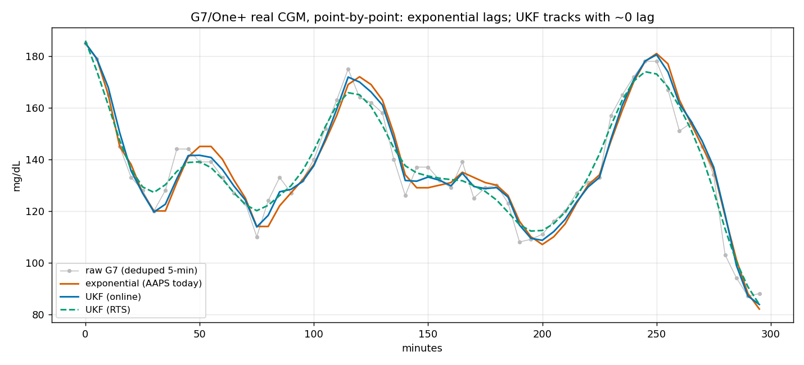

# Retiring exponential smoothing in AAPS in favour of a Kalman filter

AAPS offers exponential smoothing as one of its CGM smoothing options. On the testing set out below it is the weakest of the choices available. An Unscented Kalman Filter (UKF) estimates both the glucose level and its rate of change more accurately, with less lag and less jitter, and it rejects sensor artefacts that the exponential smoother passes through. On real data the exponential smoother, as shipped, predicts the next reading no better than doing no smoothing at all.

The evidence is reproducible without any private data. A committed, seeded benchmark includes a synthetic-CGM generator with a known underlying signal, so the ranking below can be regenerated with a single command.

This is an argument about sensing, not dosing. It makes no claim about time in range or any glycaemic outcome; those cannot be recovered from retrospective data without a glucodynamic model. It argues only that the UKF is a better estimator of the glucose signal, and its rate, than the exponential smoother — which is what a smoothing plugin is for.

---

## Reproducing the results

```
cd backtesting/scripts/2026-07-ukf-smoothing/repeatable
pip install -r requirements.txt      # numpy only for the default mode
python benchmark.py                  # synthetic, known ground truth, seeds 0..19, deterministic
```

`benchmark.py` first runs a nine-case parity check — the Python UKF used for scoring has to reproduce the behaviours in the shipped Kotlin unit test, or the run aborts — and then scores the available smoothing options against a signal whose truth is known. `--mode real --csv <file>` repeats the exercise on any CGM export; `--db` uses a local database, and `--db --sensor G7` restricts the real cohort to the G7/One+ users. The figures below come from that script.

## What AAPS ships today

The `ExponentialSmoothingPlugin` is a weighted blend of first- and second-order exponential smoothing, with four fixed constants (`o1_a=0.5`, `o2_a=0.4`, `o2_b=1.0`, `o1_weight=0.4`). It has no noise model, so the same smoothing is applied whether the sensor is quiet or noisy. It carries no state: it estimates a level, not a level and a rate, and emits `trendArrow = NONE`, so the trend is discarded. It has no handling for outliers, compression artefacts or gaps. And a second-order exponential smoother lags every real move by a fixed amount. These are properties of the method, not settings that can be tuned away.

## The evidence

Two tests, run from the same script, one on synthetic data with a known answer and one on real CGM. They agree on the ordering.

### Synthetic data, known ground truth

Because the underlying signal is known here, we can measure the thing that is unavailable on real CGM: the error of each smoother against the truth. Twenty seeds, three days each, realistic glucose dynamics with calibrated sensor noise and occasional compression artefacts. Lower is better throughout.

| smoother | RMSE vs truth | one-step RMSE | artefact passed¹ | lag² | stable-window jitter |
|---|---|---|---|---|---|
| persistence (no smoothing) | 8.64 | 8.68 | 1.00 | +0.61 | 45.4 |
| exponential (AAPS today) | 8.13 | 9.73 | 0.90 | +5.42 | 31.3 |
| UKF | 6.12 | 9.42 | 0.71 | +0.58 | 13.3 |

¹ fraction of an injected compression dip that reaches the output; lower is better, above 1.0 means amplified. ² signed tracking offset on fast transitions, mg/dL; higher means more lag.

The UKF recovers the true signal most accurately, at 6.12 against the exponential smoother's 8.13. It rejects most of an injected compression artefact where the exponential smoother passes it through, and it does so with the least lag and least jitter of the three. The exponential smoother's weakness shows in its lag, +5.42, roughly nine times the UKF's, which is the second-order ringing.

### Real CGM: the G7/One+ cohort

The modern default Dexcom sensor is the G7; the One+ shares its hardware and firmware and reports as G7, so "G7" here means G7/One+. We ran the benchmark on all six G7/One+ users in the sensor-labelled dataset, deduped to one reading per five-minute bucket. (The raw export interleaves two upload streams about a minute apart; without the dedup the series is a spurious sawtooth — worth naming, because it silently corrupts any smoother comparison run against it.)

There is no ground truth on real data, so the measures that matter are the ones that describe what a smoother does to the signal: how much in-band noise it removes, and how much it lags. Lower is better.

| smoother | stable-window variance | vs raw | directional reversals | lag |
|---|---|---|---|---|
| raw (no smoothing) | 30.8 | — | 23,972 | +0.00 |
| exponential | 35.4 | +15% (rings) | 14,971 | +5.30 |
| UKF | 18.8 | −39% | 14,014 | −0.14 |

The UKF removes about 39% of the in-band noise and cuts directional reversals by roughly 40%, at essentially zero lag. The exponential smoother reduces reversals too, but by ringing — it *increases* the amplitude variance — and it lags by the equivalent of a full reading. The point-by-point trace shows it directly: exponential (orange) trailing every peak and trough, the UKF (blue online, green RTS) tracking the raw with no lag while smoothing the noise blips.



One measure points the other way, and is reported precisely for that reason. On one-step-ahead prediction — guess the next raw reading from the current state — raw persistence wins on G7 (7.83, against the UKF's 9.02 and exponential's 9.12). But predicting the next *raw* sample means predicting its noise, which is not predictable; on an already-clean sensor this metric penalises any smoother by construction, so it scores noise-chasing rather than smoothing quality. It is the right two-sided check on a noisy signal — where it favoured the UKF — and the wrong one to headline on a clean sensor. Exponential is worst on it in any case.

Across both the synthetic ground truth and the real G7 data, the ordering that matters holds: the UKF removes the most noise at the least lag and recovers the true signal most accurately, and the exponential smoother is last — it lags and rings. The one place raw comes out ahead, one-step prediction on the already-clean G7 signal, is the metric that rewards tracking noise; it is reported, not relied on.

## How the options compare

| | exponential (today) | UKF |
|---|---|---|
| accuracy vs known truth (synthetic) | 8.13 | 6.12 |
| in-band noise removed (real G7) | none — rings (+15% variance) | ~39% |
| lag on transitions (real G7) | +5.30 mg/dL | ≈0 (−0.14) |
| trend / rate output | none (`trendArrow = NONE`) | velocity estimate, used for the trend arrow |
| adaptivity to sensor noise | none (fixed weights) | measurement noise learned online |
| outlier / artefact rejection | none (~90% passes) | chi-squared gate + absolute limit (~70% passes) |
| sensor-change / gap handling | none | reset on sensor change; gap segmentation |
| uncertainty estimate | none | full state covariance |

There is no measure on which the exponential smoother comes out ahead. The usual argument for a simple filter, that it is cheap and predictable, does not help here: its predictable behaviour is to lag, and its output is no better than the reading it was given.

## What the UKF provides

A Kalman filter is the natural fit for the problem: a noisy scalar measurement (CGM) of a slowly-evolving state (true glucose and its rate). In a single pass it provides what AAPS currently approximates with separate machinery: a smoothed level and a rate/trend estimate that rise-and-fall detection, the trend arrow and prediction can use directly; measurement noise that adapts to sensor quality rather than a fixed compromise; and outlier rejection driven by the filter's own uncertainty rather than a threshold guess. Where a little latency is acceptable, a backward (RTS) smoothing pass gives the best estimate of past points for display and analysis while the forward filter serves the live path. The implementation tested here is unit-tested and carries all of the above.

## Limitations

- No dosing or outcome claim. Retrospective data cannot give the counterfactual glucose trajectory under a different input signal. The case rests on estimator quality, which is identifiable — out of sample on real data, and against the truth in simulation.
- Smoothing versus no smoothing is a separate question. On real one-step prediction the UKF's margin over raw is small (a few percent); its clearer gains are in lag, jitter, artefact rejection and, in simulation, accuracy against the truth. None of that argues for exponential, which is worse than raw; the sensible fallback for anyone not using the UKF is no smoothing.
- One-step and truth-based error diverge on smooth data, as noted above; the truth-based measure is the primary synthetic one for that reason.
- The Python UKF used for scoring mirrors the Kotlin operation for operation and passes the shipped unit-test behaviours as a parity check; exact floating-point parity between the JVM and CPython is not separately asserted. The ordering is robust regardless, since every smoother sees the same stream.
- Changing the default would change the input signal for users currently on exponential, so the transition should be staged.

## Recommendation

1. Deprecate exponential smoothing as a recommended option. It is behind on every measure here, and as shipped its output predicts no better than no smoothing, so offering it as the middle choice steers users towards a filter that is worse than raw.
2. Adopt the UKF — measurement noise learned online, chi-squared outlier rejection, RTS backward smoothing, unit-tested.
3. Stage it: ship the UKF selectable and off by default; run the reproducible benchmark (and a golden-vector Kotlin/Python parity check) in review; then move the default from exponential to the UKF, with a note for existing users. Keep no-smoothing as the simple fallback.

---

*Reproducible evidence: `backtesting/scripts/2026-07-ukf-smoothing/repeatable/` (seeded benchmark, synthetic and real, `benchmark.py`, `results.md`). Method and identification constraints per `CLAUDE.md` and `backtesting/STATISTICAL_METHODS.md`.*
